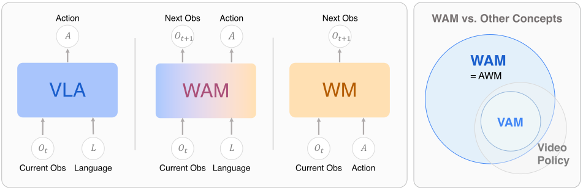
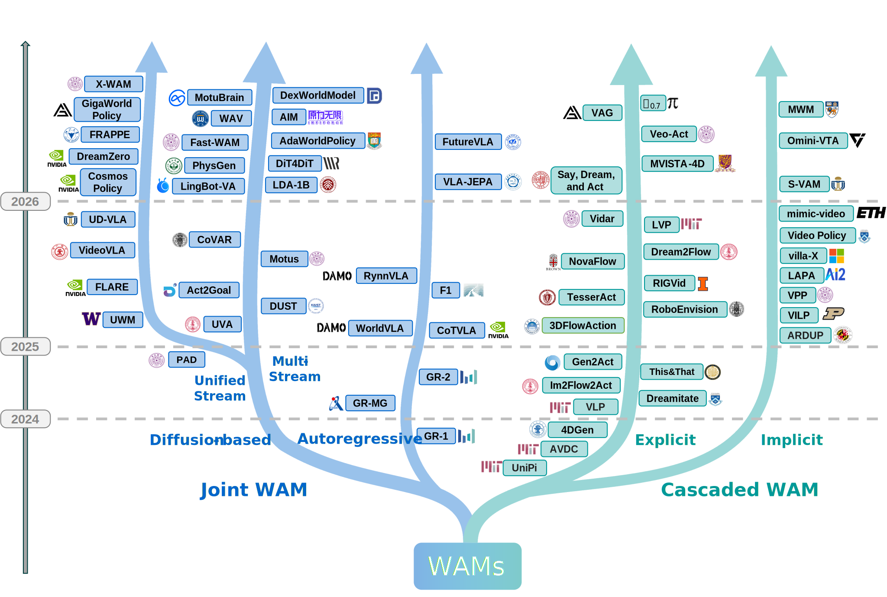
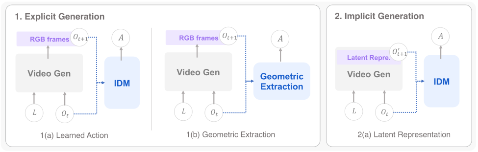
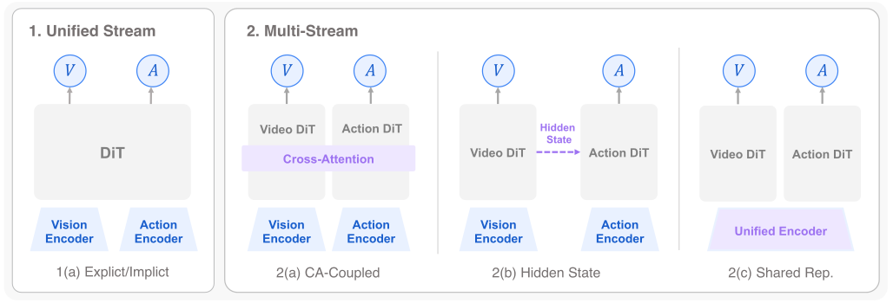
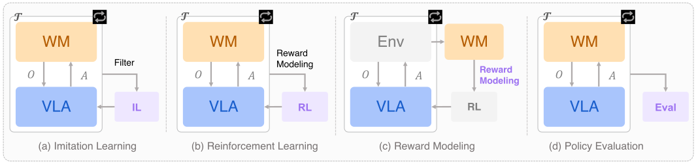
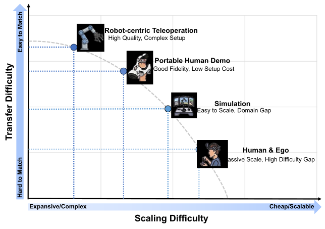

World Action Models: The Next Frontier in Embodied AI

## Problem Background

The embodied AI field is split between two parallel paradigms that have developed largely independently:

- **VLA (Vision-Language-Action Models)**: Map current observations and language instructions directly to actions via $p(a \mid o, l)$. They are reactive — they do not model what will happen next, which limits their ability to plan ahead or reason about physical consequences.
- **World Model (WM)**: Predict future states, typically via $p(o' \mid o, a)$ (action-conditioned) or $p(o' \mid o, l)$ (language-conditioned). They understand future consequences but require an external policy to generate actions — they cannot act autonomously.

Neither paradigm alone captures an agent that both understands the world and acts within it. The key question this survey asks is: can we build a single model that jointly generates actions and predicts their consequences?

### Limitations of Existing Approaches

- **VLA limitations**: Imitation learning is prone to distribution shift; action generation has no lookahead — the model does not simulate what will happen before committing to an action; physical reasoning is shallow since the model sees only the current frame with no predictive signal.
- **WM limitations**: Action-conditioned WMs $p(o' \mid o, a)$ require actions as input and produce no actions themselves; language-conditioned WMs $p(o' \mid o, l)$ do not have an action head. In both cases the world model must be composed with a separate policy, which means their objectives are misaligned and cannot reinforce each other.
- **Split optimization**: When state prediction and action generation are trained separately, the state predictor has no reason to produce representations that are useful for action, and the action policy has no reason to produce actions that are physically coherent over time.

### The Three-Paradigm Formal Comparison

To make the WAM definition precise, the survey contrasts three learning objectives:

VLA learning objective:

$$
\mathcal{L}_{VLA} = \mathbb{E}_{(o,l,a) \sim \mathcal{D}} \left[ -\log p(a \mid o, l) \right]
$$

No future state is modeled. The policy is a pure reactive mapping from current observation to action.

WM learning objective (action-conditioned):

$$
\mathcal{L}_{WM} = \mathbb{E}_{(o,a,o') \sim \mathcal{D}} \left[ -\log p(o' \mid o, a) \right]
$$

The model predicts future states given the current state and an externally provided action. It cannot generate actions and cannot be used as a policy without a separate action source.

WAM joint objective:

$$
\mathcal{L}_{WAM} = \mathbb{E}_{(o,l,o',a) \sim \mathcal{D}} \left[ -\log p(o', a \mid o, l) \right]
$$

Both outputs — future observation $o'$ and action $a$ — are generated jointly from the same language-conditioned model. This is the defining equation of the WAM paradigm.

**Caption**: Input-output comparison of VLA, WM, and WAM paradigms. WAM is the only paradigm with language instruction input, future state prediction output, and action output simultaneously — it is strictly more capable than either alone.

### Architecture Taxonomy: Cascaded vs. Joint WAMs

The survey's central organizing principle is a two-level taxonomy. At the top level, WAMs split into Cascaded and Joint depending on whether the joint distribution is factorized explicitly or learned end-to-end.

**Caption**: Temporal evolution roadmap and classification tree. Horizontal axis is time (2022→2025). Shows the progression from early video planning (UniPi, 2022) to large-scale diffusion joint WAMs (UWM, CosmosPolicy, 2025). The roadmap shows that Cascaded WAMs dominated 2022–2024 while Joint WAMs became the dominant paradigm in 2024–2025.

---

#### 1. Cascaded WAM

**Core idea**: Explicitly factorizes the joint distribution into two sequential steps — first predict the future, then extract actions from that prediction:

Cascaded WAM factorization:

$$
p(o', a \mid o, l) = p(a \mid o', o, l) \cdot p(o' \mid o, l)
$$

**Meaning**: The world model $p(o' \mid o, l)$ generates a future observation conditioned on language; the action extractor $p(a \mid o', o, l)$ then infers what action would produce that transition. The two components can be trained and designed independently.

**Why cascade?** Factorizing allows reuse of large pretrained video generation models (e.g., Imagen Video, Stable Video Diffusion) for the world model step without modifying their architecture. The action extraction step is lightweight by comparison. This makes Cascaded WAMs a practical near-term path.

**Limitation of cascading**: The world model is trained without action supervision, so it may generate visually plausible but mechanically impossible videos. The action extractor then tries to infer actions from those imperfect predictions, compounding errors. There is no feedback from action quality back to the world model.

Cascaded WAMs split further by how actions are extracted from predicted video:

**Explicit-Learned (IDM)**: The world model generates pixel-level video frames $\hat{o}'$. A separate Inverse Dynamics Model (IDM) — typically a small CNN+MLP — takes consecutive frame pairs $(\hat{o}_t, \hat{o}_{t+1})$ and regresses the robot joint action $a_t$ that would cause that transition. Representative works: [UniPi](WAM-Survey/UniPi.md), [GR-MG](WAM-Survey/GR-MG.md), [RoboEnvision](WAM-Survey/RoboEnvision.md), Gen2Act.

**Explicit-Geometric**: Instead of learning an IDM, geometric priors extract actions from predicted video — optical flow gives 2D motion that maps to end-effector velocity, 3D point tracking gives spatial displacement, 4D Gaussian Splatting gives full 3D trajectories. This is more interpretable and does not require action-annotated training data for the extraction step. Representative works: [Im2Flow2Act](WAM-Survey/Im2Flow2Act.md), [ThisAndThat](WAM-Survey/ThisAndThat.md), 4DGen.

**Implicit (Latent)**: The world model operates entirely in a learned latent space $z'$ rather than pixel space, bypassing the expensive pixel-level video generation step. A policy head attached to the latent representation generates actions directly. This trades visual interpretability for inference speed. Representative works: [VLA-JEPA](WAM-Survey/VLA-JEPA.md), [VLP](WAM-Survey/VLP.md), [ARDuP](WAM-Survey/ARDuP.md), [VILP](WAM-Survey/VILP.md).

**Caption**: Three Cascaded WAM sub-architectures illustrated side by side. (1a) Explicit-Learned: video diffusion generates pixel frames, IDM extracts actions. (1b) Explicit-Geometric: video diffusion generates frames, geometric prior (flow/3D) extracts actions. (2) Implicit: latent world model predicts in embedding space, policy head generates actions without pixel rendering.

| Method       | Type               | Visual Generation | Action Extraction | Year |
| ------------ | ------------------ | ----------------- | ----------------- | ---- |
| [UniPi](WAM-Survey/UniPi.md)        | Explicit-Learned   | Video Diffusion   | IDM               | 2023 |
| SuSIE        | Explicit-Learned   | Video Diffusion   | IDM               | 2023 |
| [AVDC](WAM-Survey/AVDC.md)         | Explicit-Learned   | Video Diffusion   | IDM               | 2023 |
| [GR-MG](WAM-Survey/GR-MG.md)        | Explicit-Learned   | Video Diffusion   | IDM               | 2024 |
| [Gen2Act](WAM-Survey/Gen2Act.md)      | Explicit-Learned   | Video Diffusion   | IDM               | 2024 |
| [RoboEnvision](WAM-Survey/RoboEnvision.md) | Explicit-Learned   | Video Diffusion   | IDM               | 2024 |
| [SayDreamAct](WAM-Survey/SayDreamAct.md)  | Explicit-Learned   | Video Diffusion   | IDM               | 2024 |
| [Mimic-Video](WAM-Survey/mimic-video.md)  | Explicit-Learned   | Video Diffusion   | IDM               | 2024 |
| [Dream2Flow](WAM-Survey/Dream2Flow.md)   | Explicit-Learned   | Video Diffusion   | IDM               | 2025 |
| [Im2Flow2Act](WAM-Survey/Im2Flow2Act.md)  | Explicit-Geometric | Optical Flow      | Flow→Action       | 2024 |
| [This&That](WAM-Survey/ThisAndThat.md)    | Explicit-Geometric | Point Tracking    | Geometry          | 2024 |
| [4DGen](WAM-Survey/4DGen.md)        | Explicit-Geometric | 4D Gaussian       | Geometry          | 2024 |
| [VLP](WAM-Survey/VLP.md)          | Implicit           | Latent WM         | Latent Policy     | 2023 |
| [LV-P](WAM-Survey/LV-P.md)         | Implicit           | Latent WM         | Latent Policy     | 2024 |
| [ARDuP](WAM-Survey/ARDuP.md)        | Implicit           | Latent WM         | Policy Head       | 2025 |
| [VLA-JEPA](WAM-Survey/VLA-JEPA.md)     | Implicit           | JEPA Latent       | Policy Head       | 2025 |
| [VILP](WAM-Survey/VILP.md)         | Implicit           | Latent WM         | Policy Head       | 2025 |

**Key observation**: Explicit pixel-level methods are most interpretable (you can watch the plan as a video) but slowest at inference — video diffusion at high resolution takes >1s per step. Implicit methods are fastest but sacrifice the interpretable world-state representation.

---

#### 2. Joint WAM

**Core idea**: Directly models the full joint distribution $p(o', a \mid o, l)$ without explicit factorization. The world model and action policy share parameters and are co-optimized end-to-end. The key question for Joint WAMs is the generation mechanism: autoregressive (discrete tokens) or diffusion (continuous denoising).

##### 2a. Autoregressive Joint WAM

Visual and action tokens are treated as a single unified sequence. The model predicts the next token autoregressively — some tokens are image patches (or DINO features), others are action dimensions. Training is standard next-token prediction with a shared vocabulary or dual output head.

**Advantage**: Architecturally simple — any large language model backbone can be adapted. The model naturally handles variable-length observation and action histories.

**Limitation**: Inference requires sequential token generation, which is slow for long action sequences. The discrete token vocabulary may not capture fine-grained continuous action precision needed for manipulation.

Representative works and their key design choices:

- [GR-1](WAM-Survey/GR-1.md) / [GR-2](WAM-Survey/GR-2.md): GPT backbone; visual tokens are DINO patch features; action tokens are continuous values decoded via a separate head. GR-2 extended to long-horizon video prediction with a recurrent prediction scheme.
- [CoT-VLA](WAM-Survey/CoT-VLA.md): Introduces visual chain-of-thought — the model first generates intermediate visual "reasoning" frames before generating actions, mimicking how humans think through a plan before executing.
- [WorldVLA](WAM-Survey/WorldVLA.md): Fully unified autoregressive model where image tokens and action tokens share a single LLM vocabulary; no separate action head.
- [VLA-JEPA](WAM-Survey/VLA-JEPA.md): Adapts the JEPA (Joint Embedding Predictive Architecture) framework — predicts in latent embedding space rather than pixel space, more efficient than pixel-level AR generation.

| Method   | Backbone    | Visual Token | Action Token  | Year |
| -------- | ----------- | ------------ | ------------- | ---- |
| [GR-1](WAM-Survey/GR-1.md)     | GPT         | DINO patches | Continuous    | 2023 |
| [GR-2](WAM-Survey/GR-2.md)     | GPT         | DINO patches | Continuous    | 2024 |
| [CoT-VLA](WAM-Survey/CoT-VLA.md)  | VLM         | Visual CoT   | Action Head   | 2024 |
| [WorldVLA](WAM-Survey/WorldVLA.md) | LLM         | Image tokens | Action tokens | 2025 |
| [F1](WAM-Survey/F1.md)       | Transformer | Video tokens | Action tokens | 2025 |

##### 2b. Diffusion-based Joint WAM

Diffusion WAMs jointly denoise both future visual observations and action sequences from Gaussian noise. The key architectural question is whether visual and action denoising share a single network stream or maintain separate streams with a coupling mechanism.

**Caption**: Full taxonomy of diffusion Joint WAM architectures. Left branch: Unified Stream — visual and action tokens are concatenated and denoised by a single DiT, the simplest design. Right branch: Multi-Stream — visual and action denoising run in separate DiT branches coupled by one of three mechanisms: Cross-Attention (action queries attend to visual keys/values), Hidden-State Coupling (intermediate features are shared between branches), or Shared Representation (early layers are shared, late layers are specialized).

**Unified Stream**: Visual tokens and action tokens are concatenated into a single sequence and passed through a shared DiT. A single denoising pass produces both $\hat{o}'$ and $\hat{a}$ simultaneously. This is architecturally simplest and has no coupling overhead, but visual tokens and action tokens must compete for the same attention capacity — visual tokens can "distract" the action head and vice versa. Representative: [UWM](WAM-Survey/UWM.md), CosmosPolicy, DreamZero, FLARE, FRAPPE.

**Multi-Stream — Cross-Attention Coupling**: Separate DiT branches for visual and action denoising. The action branch attends to visual features via cross-attention at each denoising step, allowing the action policy to read visual predictions without contaminating the visual stream. Representative: PAD, VideoVLA, CoVAR.

**Multi-Stream — Hidden-State Coupling**: Intermediate hidden states from the visual branch are injected into the action branch (e.g., via addition or concatenation at specific layers). More lightweight than cross-attention but less expressive. Representative: LDA-1B, STARRY.

**Multi-Stream — Shared Representation**: Early DiT layers are shared between visual and action streams; later layers are specialized. The shared early layers learn task-relevant features usable by both objectives, while the specialized late layers focus each stream on its output modality. Representative: UVA, PhysGen.

| Method | Stream | Coupling | Backbone | Year |
|--------|--------|----------|----------|------|
| [PAD](WAM-Survey/PAD.md) | Multi | Cross-Attn | DiT | 2024 |
| [UWM](WAM-Survey/UWM.md) | Unified | — | DiT | 2024 |
| DreamZero | Unified | — | DiT | 2024 |
| CosmosPolicy | Unified | — | Video DiT | 2025 |
| FLARE | Unified | — | DiT | 2025 |
| FRAPPE | Unified | — | DiT | 2025 |
| [VideoVLA](WAM-Survey/VideoVLA.md) | Multi | Cross-Attn | Video DiT | 2025 |
| CoVAR | Multi | Cross-Attn | DiT | 2025 |
| LDA-1B | Multi | Hidden-State | DiT | 2025 |

**Key design trade-off**: Unified Stream is simpler but risks token competition; Multi-Stream adds coupling complexity but keeps visual and action generation from interfering. The survey finds no definitive winner — the best choice depends on the relative difficulty of the visual prediction vs. action precision required by the task.

---

### Four Roles of World Models in VLA Learning

Beyond architectures that learn $p(o', a \mid o, l)$ jointly, the survey identifies four ways a world model can improve a VLA without necessarily being part of the same model:

**Caption**: The four WM-for-VLA paradigms. (1) Imitation Learning: WM generates additional training trajectories with synthesized goal images, expanding the training distribution without physical robot time. (2) Reinforcement Learning: WM acts as a differentiable simulator, allowing the policy to practice inside the model without real-world rollouts. (3) Reward Modeling: WM predicts task completion from synthesized future frames, providing a dense reward signal without hand-designed reward functions. (4) Evaluation: WM evaluates policy quality by simulating execution and measuring visual fidelity or task success, enabling automated offline policy selection.

This four-role framing is useful because it covers systems that do not fit cleanly into Cascaded or Joint WAM architectures but still use predictive world modeling to improve robot learning.

---

### Training Data Ecosystem

Understanding WAM training data requires understanding the trade-off between **transfer difficulty** (how hard it is to adapt knowledge from this data source to a new robot) and **scaling difficulty** (how hard it is to collect more data of this type).

**Caption**: 2D landscape of embodied training data. Transfer difficulty (horizontal) vs. scaling difficulty (vertical). Robot teleoperation data sits at low transfer/high scaling difficulty: it is exactly on-distribution for the target robot but expensive to collect at scale. Human egocentric video (Ego4D, EPIC-Kitchens) sits at high transfer/low scaling difficulty: there is enormous internet-scale video of humans performing tasks, but the domain gap to robot end-effectors is large. Simulation data sits near the origin: cheap to generate and reasonably diverse, but the sim-to-real gap must be bridged.

**Robot-centric manipulation datasets** (lowest transfer difficulty):

| Dataset | Scale | Platform | Characteristics |
|---------|-------|----------|-----------------|
| RT-1 | 130K trajectories | Mobile Manipulator | Daily household tasks |
| Bridge V2 | 60K trajectories | WidowX | Kitchen manipulation |
| Open X-Embodiment (OXE) | 1M+ trajectories | Multi-platform | Cross-embodiment aggregate from 22 robots |
| DROID | 76K trajectories | Franka | High diversity of environments |
| RoboMIND | 55K trajectories | Multiple | Multi-task, includes Chinese instructions |

**UMI-style hand-collection datasets** (middle ground — low collection cost, moderate transfer difficulty):

| Dataset | Scale | Collection Method | Characteristics |
|---------|-------|-------------------|-----------------|
| UMI | 24K trajectories | Cup-in-Hand gripper | Human demonstrates by holding gripper directly |
| ARIO | 100K+ trajectories | Arm + UMI | Hybrid: some robot-arm, some hand-held |

UMI-style collection dramatically lowers the hardware barrier by replacing a full robot arm with a hand-held gripper device, enabling rapid scaling. The trade-off is that the data lacks full proprioceptive state and the demonstrations are from a human-embodied perspective.

**Simulation datasets** (highest scaling potential):

| Dataset | Environment | Scale | Characteristics |
|---------|-------------|-------|-----------------|
| RoboAgent | IsaacGym | 100K | Fast physics simulation |
| ManipGen | IsaacGym | 1M+ | Procedurally generated task diversity |
| GR-1 Sim | Habitat | 20K | Navigation + manipulation combined |

**Human / Egocentric datasets** (largest scale, highest transfer difficulty):

| Dataset | Scale | Source | Characteristics |
|---------|-------|--------|-----------------|
| EPIC-Kitchens | 100 hours | First-person view | Kitchen manipulation with action labels |
| Ego4D | 3670 hours | First-person view | Broad daily activities, weak action labels |
| HOI4D | 2.4M frames | RGBD | Human-object interaction with 3D annotations |
| Something-Something | 220K videos | Third-person | Object manipulation, good for temporal reasoning |

The key data challenge for WAMs is that robot teleoperation data (which has clean action labels) is scarce, while video data (which has no action labels) is abundant. WAMs that can learn from unlabeled video — using the world model objective as self-supervision — have a natural path to leverage the internet-scale video corpus.

### Evaluation: World Modeling Metrics

Evaluating the world model component of a WAM requires metrics that go beyond task success rate. The survey covers three levels of evaluation:

**Visual fidelity metrics** (measure how realistic the predicted future frames are):

Peak Signal-to-Noise Ratio:

$$
\text{PSNR}(x, y) = 10 \cdot \log_{10} \left( \frac{\text{MAX}^2}{\text{MSE}(x, y)} \right)
$$

Pixel-level accuracy. Higher is better (>30 dB is generally considered good quality). Simple but does not capture perceptual quality — a blurry prediction can have high PSNR if the blur matches the mean.

Structural Similarity Index:

$$
\text{SSIM}(x,y) = \frac{(2\mu_x\mu_y + C_1)(2\sigma_{xy} + C_2)}{(\mu_x^2 + \mu_y^2 + C_1)(\sigma_x^2 + \sigma_y^2 + C_2)}
$$

Measures luminance, contrast, and structure jointly. Range $[-1, 1]$; higher is better. More robust to global brightness shifts than PSNR. Symbols: $\mu_x, \mu_y$ — image means; $\sigma_x^2, \sigma_y^2$ — variances; $\sigma_{xy}$ — covariance; $C_1, C_2$ — stability constants.

Learned Perceptual Image Patch Similarity:

$$
\text{LPIPS}(x, y) = \sum_l \frac{1}{H_l W_l} \sum_{h,w} \left\| w_l \odot \left( \hat{f}_l(x)_{hw} - \hat{f}_l(y)_{hw} \right) \right\|_2^2
$$

Uses pretrained deep network features to measure perceptual similarity. Lower is better. More aligned with human judgment than PSNR/SSIM for natural images. $\hat{f}_l$ — normalized feature map at layer $l$; $w_l$ — learned per-layer weights.

DreamSim similarity (human-calibrated perceptual distance):

$$
\text{DreamSim}(x, y) = 1 - \| E(x) - E(y) \|_2
$$

Embedding distance in a space specifically fine-tuned on human perceptual similarity judgments. More reliable than LPIPS for comparing generated robot manipulation frames where subtle motion differences matter.

DINO feature consistency (semantic alignment):

$$
\text{DINO}(g_t, r_t) = \frac{\langle f(g_t), f(r_t) \rangle}{\|f(g_t)\|_2 \cdot \|f(r_t)\|_2}
$$

Cosine similarity of DINO features between generated frame $g_t$ and reference frame $r_t$. Measures whether the generated frame is semantically consistent (same objects, same scene layout) even if pixel-level details differ.

Fréchet Video Distance (video-level distribution quality):

$$
\text{FVD} = \|\mu_r - \mu_g\|_2^2 + \text{Tr}\left(\Sigma_r + \Sigma_g - 2(\Sigma_r \Sigma_g)^{1/2}\right)
$$

Measures the distance between the distribution of real videos and generated videos in a feature space. Lower is better. Analogous to FID for images but captures temporal consistency. $\mu_r, \mu_g$ — mean feature vectors; $\Sigma_r, \Sigma_g$ — covariance matrices.

**Physical plausibility metrics** (measure whether predicted futures obey physics):

| Metric | Focus | What it tests |
|--------|-------|---------------|
| VideoPhy | Physical laws | Object continuity, gravity, collision |
| PhyGenBench | Mechanics/gravity | Force, momentum, rigid body dynamics |
| VBench-2.0 | Overall video quality | Combined visual + physical quality |
| WorldSimBench | Action plausibility | Whether the depicted actions are executable |

**Action policy evaluation benchmarks**:

| Benchmark | Environment | Task Type | Evaluation |
|-----------|-------------|-----------|------------|
| Calvin | Simulated | Table manipulation sequences | Success rate on 5-task chains |
| SimplerEnv | Simulated | RT-1/Bridge tasks | Generalization to unseen objects |
| MetaWorld | Simulated | 50 manipulation types | Per-task success rate |
| RoboSuite | Simulated | Structured manipulation | Precise manipulation success |
| LIBERO | Simulated | 130 tasks across 4 suites | Cross-suite generalization |
| Real Robot | Real | Lab-specific tasks | Task completion rate |

### Summary

- **Cascaded Explicit-Learned WAMs** (e.g., [UniPi](WAM-Survey/UniPi.md), [GR-MG](WAM-Survey/GR-MG.md)): Produce visually compelling video plans but inference takes >1 second per step at useful resolution — incompatible with reactive robot control at >10 Hz. Best suited for offline plan generation followed by open-loop execution.
- **Cascaded Implicit WAMs** (e.g., [VLA-JEPA](WAM-Survey/VLA-JEPA.md)): Inference is fast (comparable to standard VLAs) but the latent world model is uninterpretable. The world model acts as a learned feature extractor more than a simulator.
- **Joint Diffusion WAMs** (e.g., [UWM](WAM-Survey/UWM.md), CosmosPolicy): The survey finds that co-training the world model and action policy with a joint diffusion objective consistently improves manipulation success rate by 10–30% over VLA-only baselines across multiple benchmarks. The world model loss acts as a strong regularizer that prevents the action policy from overfitting to the behavioral cloning objective.
- **Autoregressive Joint WAMs** (e.g., [GR-2](WAM-Survey/GR-2.md)): Excel at cross-task generalization due to the unified token representation, but require careful tokenization design to maintain continuous action precision.

---

## Seven Open Challenges

The survey concludes with seven research challenges that define the frontier of WAM development:

1. **Efficient inference**: Diffusion WAMs require multi-step denoising (typically 10–100 steps), creating latency of 100ms–1s per control step. Real-time robot control requires <10ms. Consistency models and flow matching reduce steps but cannot yet match the quality of full diffusion at comparable speed.

2. **Missing evaluation standards**: No unified WAM-specific benchmark exists. Current evaluation borrows from VLA benchmarks (task success) and video generation benchmarks (FVD, PSNR), but neither captures the key property of WAMs — that world model quality and action quality should be evaluated jointly and interactively.

3. **Architecture coupling trade-off**: Unified Stream is simpler but visual and action tokens compete for attention capacity. Multi-Stream adds coupling complexity (cross-attention, hidden state sharing) and introduces design choices that are not yet well understood. The optimal coupling strategy likely depends on task properties (e.g., precision vs. diversity of actions).

4. **Cross-embodiment generalization**: Current WAMs are mostly trained and evaluated on a single robot morphology. The embodied data landscape (Figure 6) shows that human egocentric video is abundant but has high transfer difficulty. Bridging this gap — using human video to train robot WAMs — requires solving the morphological correspondence problem.

5. **Long-horizon planning**: Prediction error accumulates over time in both the world model and the action policy. Cascaded WAMs that generate multi-step video plans face compounding hallucination. Joint WAMs trained on short action chunks (typically T=8–16 steps) struggle to compose into coherent long-horizon task execution.

6. **Data quality and annotation**: The largest available video datasets (Ego4D, Something-Something) lack action annotations. Pseudo-labeling with inverse dynamics models introduces noise. Robot teleoperation data is accurate but expensive to scale beyond ~1M trajectories. A practical data strategy for WAMs requires resolving this annotation bottleneck.

7. **Safety and alignment**: A WAM that can simulate dangerous future states (e.g., collision, human injury) creates new safety risks if the generated plans are executed without verification. WAMs need constraint mechanisms — either in the world model (rejecting physically infeasible or unsafe predictions) or in the action policy (action safety filters).

---

### Representative Methods (Cascaded WAM)

- [UniPi](WAM-Survey/UniPi.md): Earliest explicit pixel-level cascaded WAM (2023); established the video-as-plan paradigm
- [GR-MG](WAM-Survey/GR-MG.md): Representative of learned action extraction; adds goal-image conditioning to video diffusion
- [VLA-JEPA](WAM-Survey/VLA-JEPA.md): Implicit cascaded WAM; uses JEPA latent prediction as a world model signal

### Representative Methods (Joint WAM)

- [GR-1](WAM-Survey/GR-1.md): One of the earliest autoregressive joint WAMs; DINO features + GPT backbone
- [GR-2](WAM-Survey/GR-2.md): Extends GR-1 with improved long-horizon video prediction and larger training data
- [UWM](WAM-Survey/UWM.md): Canonical unified-stream diffusion joint WAM; joint DiT denoises video + action
- [WorldVLA](WAM-Survey/WorldVLA.md): Latest AR joint WAM; fully unified LLM vocabulary for images and actions
- [PAD](WAM-Survey/PAD.md): Multi-stream cross-attention coupled diffusion WAM
- [VideoVLA](WAM-Survey/VideoVLA.md): Multi-stream video DiT with cross-attention action coupling

### Techniques

- Action Chunking: Core action representation technique; most WAMs predict T=8–16 step action chunks
- DiT: Dominant backbone for diffusion joint WAMs
- Flow Matching: Alternative to DDPM used in several WAMs (e.g., STARRY); fewer inference steps
- JEPA: Predictive representation learning framework underlying several implicit WAMs

### Evaluation Metrics

- PSNR, SSIM, LPIPS, FVD, DreamSim: World modeling quality metrics discussed in the survey

### Architecture Foundations

- Mixture-of-Transformers: Foundation for independently parameterized multi-stream WAMs
- Latent Diffusion Model: Latent-space diffusion base for implicit cascaded WAMs

---

> [!summary] World Action Models Survey (2026)
> - **Core**: WAM = jointly learn $p(o', a \mid o, l)$, unifying VLA and world model research threads
> - **Taxonomy**: Cascaded (explicit pixel / implicit latent) × Joint (autoregressive / diffusion), four categories
> - **Trend**: Since 2025, joint diffusion WAMs (UWM, CosmosPolicy) dominate; 10–30% improvement over VLA baselines
> - **Challenges**: Inference latency, missing evaluation standards, cross-embodiment transfer, long-horizon planning
> - **Code**: https://github.com/OpenMOSS/Awesome-WAM
